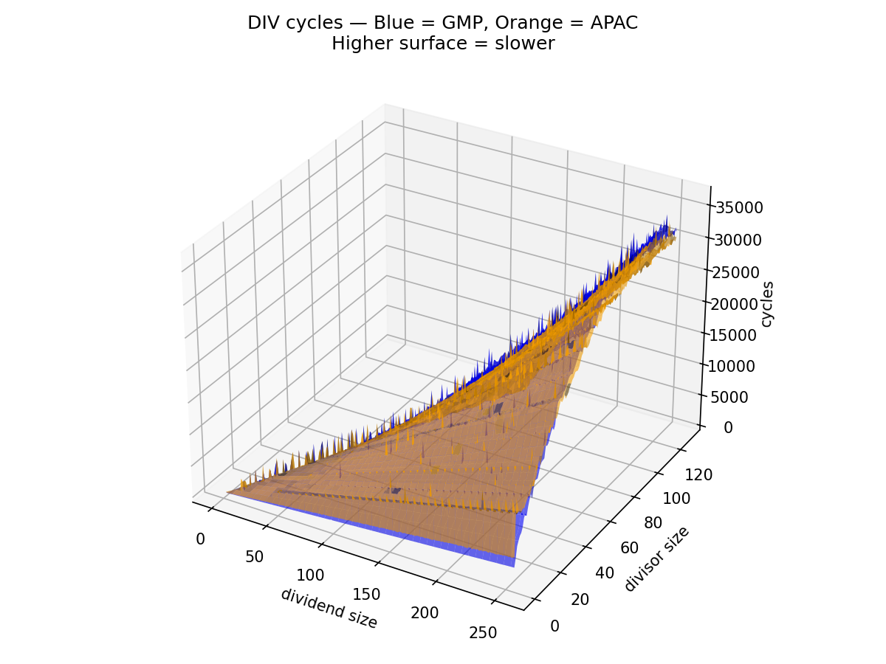
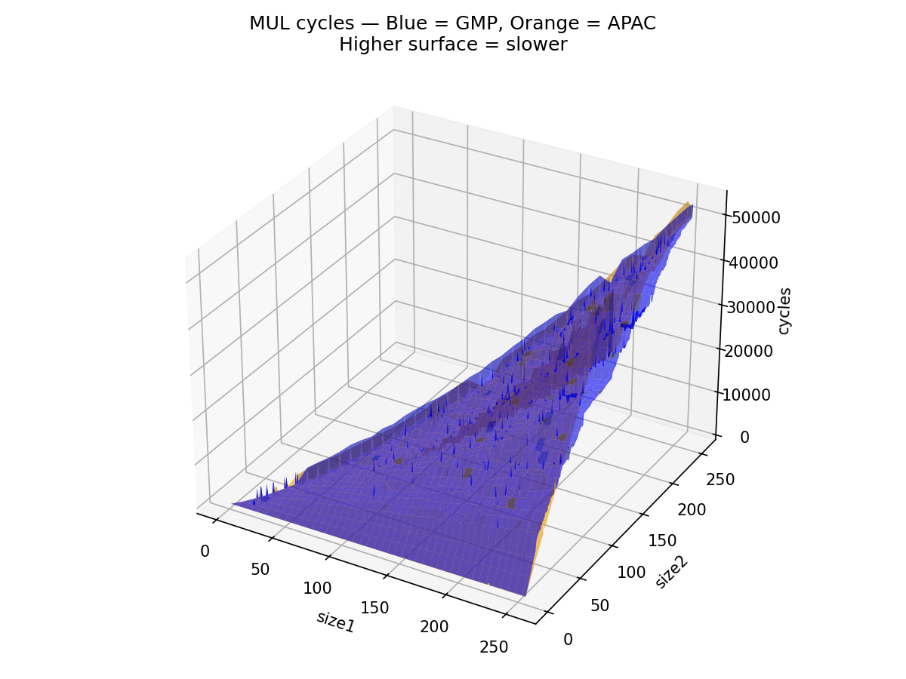
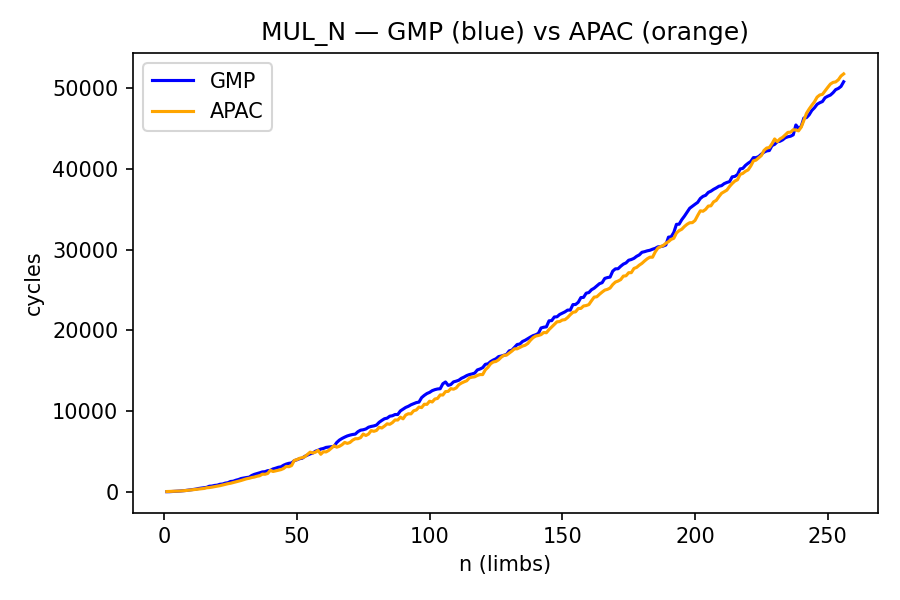
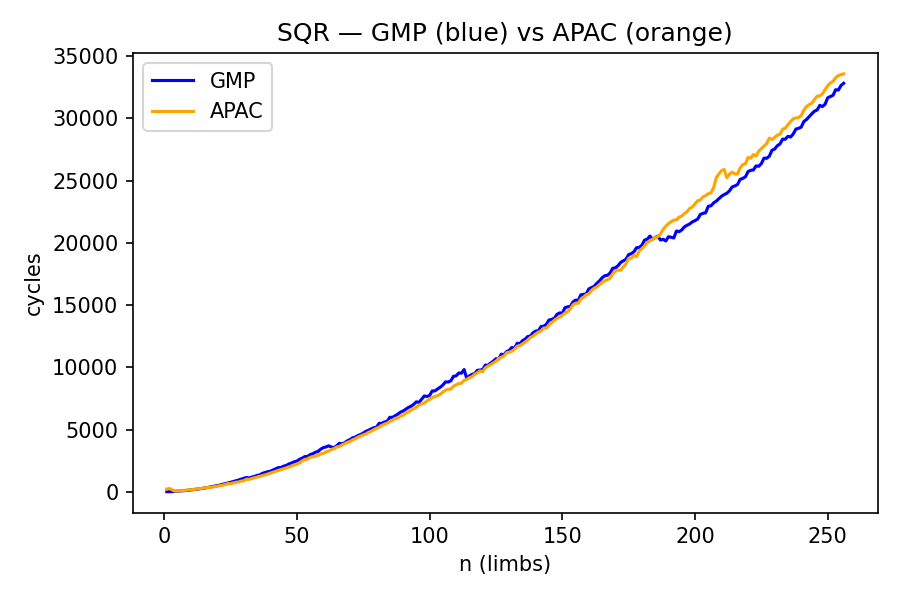

# libapac

**libapac** is a free and open-source, high-performance C library for
arbitrary-precision integer arithmetic and related computations.

## Build Requirements

### Windows

- **Operating System:** 64-bit Windows
- **C11 Compiler:** MSVC (`cl.exe`) or Clang (`clang-cl`)
- **Build Generator:** CMake ≥ 3.12
- **Build System:** MSBuild or Ninja
- **x86-64 Assembler:** MASM (Microsoft Macro Assembler)

**NOTE:** MinGW toolchain is **not supported**.

### Linux

- **Operating System:** 64-bit Linux (x86-64)
- **C11 Compiler:** GCC or Clang
- **Build Generator:** CMake ≥ 3.12
- **Build System:** Make or Ninja
- **x86-64 Assembler:** GAS (GNU Assembler)

## Building the Library

1. **Clone the repository**

   ```sh
   git clone https://github.com/EpsilonNought117/libapac.git
   cd libapac
   ```

2. **Configure the project**

    - Windows

      ```sh
      cmake -S . -B build -G "Visual Studio 18 2026"
      ```

    - Linux

      ```sh
      cmake -S . -B build -DCMAKE_BUILD_TYPE=Release
      ```

3. **Build the project**

    - Windows

      ```sh
      cmake --build build --config Release
      ```
  
    - Linux

      ```sh
      cmake --build build --parallel
      ```

## CMake Variables

The following CMake options control optional components of the build.  
All options can be enabled or disabled during the CMake configuration step
(e.g. via `-D<OPTION>=ON|OFF`).

| Variable            | Description                                                          | Default |
|---------------------|----------------------------------------------------------------------|---------|
| `BUILD_SHARED_LIB`  | Build **libapac** as a shared library (`.dll` / `.so`)               | `OFF`   |
| `BUILD_APN_TESTS`   | Build the `apn_tests` program for correctness testing                | `ON`    |
| `BUILD_APN_TUNE`    | Build the `apn_tune` algorithm threshold tuning utility              | `ON`    |
| `BUILD_EXAMPLES`    | Build example programs demonstrating library usage                   | `ON`    |

## Optimized Microarchitectures

The following x86-64 microarchitectures contain assembly code especially optimized for them

  - AMD Zen 4
  - AMD Zen 5

## Performance Comparison (vs GMP 6.3.0)

> **Note on benchmarking:**  
> These results were obtained by comparing **libapac** against **GMP 6.3.0** x86 
> fat-binary built from source, running on an **AMD Ryzen 7 8845HS (Zen 4)**, with
> benchmark code compiled using **GCC 14.2 at `-O2`** optimization level.

<table border="0" cellspacing="0" cellpadding="0" style="border-collapse: collapse; border: none;">
  <tr>
    <td style="border: none;">
      
    </td>
    <td style="border: none;">
      
    </td>
  </tr>
  <tr>
    <td style="border: none;">
      
    </td>
    <td style="border: none;">
      
    </td>
  </tr>
</table>

## Example Usage

Before using any libapac routines, the library must be initialized to perform
CPU feature detection and set up optimized dispatch tables.

```c
#include "apac.h"

int main(void)
{
    /* Initialize (CPU detection, memory allocation functions etc.,) */
    apacInit();

    /* Library is now ready for use */

    return 0;
}
```
